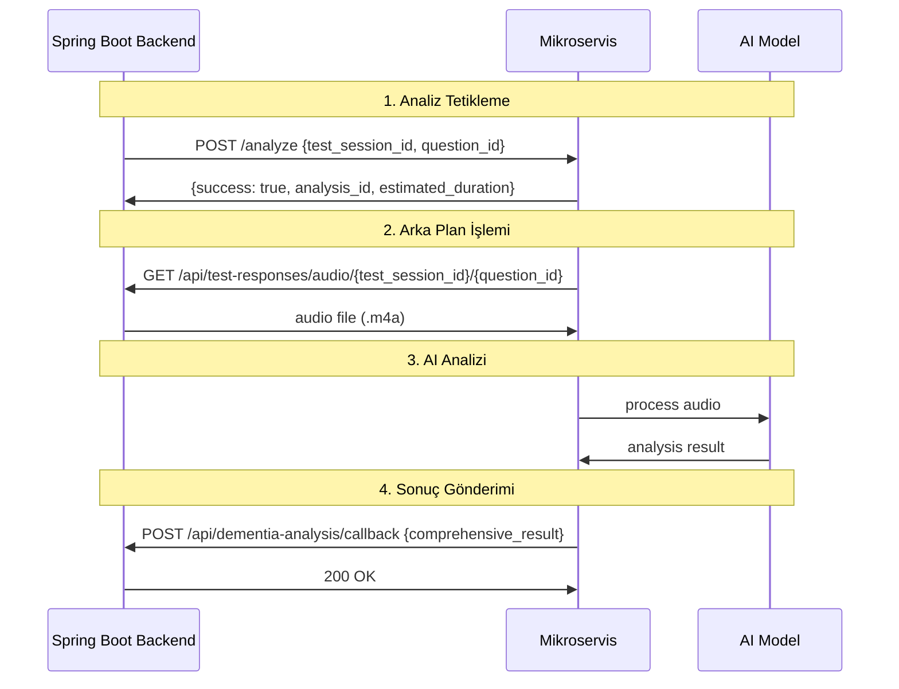

# 🎯 Backend-Triggered Mikroservis Entegrasyon Rehberi

## 🚀 Sistem Mimarisi



---

## 📥 Backend'den Mikroservise

### **Endpoint:** `POST /analyze`

Backend'iniz bu endpoint'e istek atacak:

```json
{
  "test_session_id": "eiRJer6JowfCJjSQ4LLM",
  "question_id": "iLEstW6nRQXARxdObGcR"
}
```

### **Response:**

```json
{
  "success": true,
  "message": "Analiz başlatıldı - Backend workflow aktif",
  "analysis_id": "eiRJer6JowfCJjSQ4LLM_iLEstW6nRQXARxdObGcR_1751307975",
  "estimated_duration": 30
}
```

### **cURL Örneği:**

```bash
curl -X POST "http://your-microservice:8000/analyze" \
  -H "Content-Type: application/json" \
  -d '{
    "test_session_id": "eiRJer6JowfCJjSQ4LLM",
    "question_id": "iLEstW6nRQXARxdObGcR"
  }'
```

---

## 🎵 Ses Dosyası İndirme

Mikroservis otomatik olarak bu URL'den ses dosyasını indirir:

```
GET https://demantia-backendv2-dev.onrender.com/api/test-responses/audio/{test_session_id}/{question_id}
```

**Gereksinimler:**

- ✅ Bu endpoint .m4a dosyası dönmelidir
- ✅ 401/403 olmadan erişilebilir olmalıdır
- ✅ Dosya boyutu makul olmalıdır (~1-10MB)

---

## 📤 Mikroservisten Backend'e Callback

### **Endpoint:** `POST /api/dementia-analysis/callback`

Mikroservis analiz sonucunu bu endpoint'e gönderir. Backend'inizde bu endpoint'i hazırlamanız gerekiyor:

```json
{
  "timestamp": "2025-06-30T20:30:01.957410",
  "recommendations": [
    "Sonuçlar normal aralıkta ancak takip önerilir",
    "6 ay sonra tekrar değerlendirme yapılabilir"
  ],
  "status": "completed",
  "test_session_id": "eiRJer6JowfCJjSQ4LLM",
  "question_id": "iLEstW6nRQXARxdObGcR",
  "analysis_id": "eiRJer6JowfCJjSQ4LLM_iLEstW6nRQXARxdObGcR_1751304599",
  "processing_time_seconds": 2.058374,
  "start_time": "2025-06-30T20:29:59.899036",
  "end_time": "2025-06-30T20:30:01.957410",
  "dementia_status": "normal",
  "confidence_score": 0.4,
  "risk_level": "MEDIUM",
  "normal_score": 0.4,
  "mci_score": 0.343,
  "dementia_score": 0.257,
  "cognitive_decline_risk": 0.6,
  "memory_impairment_likelihood": 0.3428,
  "speech_pattern_anomalies": 0.6,
  "attention_deficit_indicator": 0.4972,
  "language_fluency_score": 0.4,
  "overall_cognitive_health": 40.0,
  "audio_duration_seconds": 3.413,
  "audio_format": "m4a",
  "audio_sample_rate": 22050,
  "audio_channels": 1,
  "audio_quality": "good",
  "feature_count": 60,
  "model_name": "RandomForest",
  "model_version": "1.0",
  "model_method": "trained_model",
  "model_training_date": "2025-06-30T19:45:53",
  "model_accuracy": "95%",
  "feature_extraction_time": 1.4408618,
  "model_inference_time": 0.6175122,
  "server_location": "microservice",
  "api_version": "1.0.0",
  "error_message": null,
  "session_type": "screening",
  "priority_level": 1
}
```

---

## 🔧 Backend Controller Örneği

```java
@RestController
@RequestMapping("/api/dementia-analysis")
public class DementiaAnalysisController {

    @Autowired
    private DementiaAnalysisService analysisService;

    @PostMapping("/trigger")
    public ResponseEntity<?> triggerAnalysis(@RequestBody TriggerRequest request) {
        try {
            // Mikroservise istek gönder
            String microserviceUrl = "http://your-microservice:8000/analyze";

            Map<String, String> payload = Map.of(
                "test_session_id", request.getTestSessionId(),
                "question_id", request.getQuestionId()
            );

            // HTTP client ile istek gönder
            RestTemplate restTemplate = new RestTemplate();
            ResponseEntity<Map> response = restTemplate.postForEntity(
                microserviceUrl, payload, Map.class
            );

            return ResponseEntity.ok(response.getBody());

        } catch (Exception e) {
            return ResponseEntity.status(500).body(
                Map.of("error", "Mikroservis tetiklenemedi", "details", e.getMessage())
            );
        }
    }

    @PostMapping("/callback")
    public ResponseEntity<Void> receiveAnalysisResult(@RequestBody AnalysisResultDto result) {
        try {
            // Sonucu veritabanına kaydet
            analysisService.saveAnalysisResult(result);

            // Mobil uygulamaya bildirim gönder (WebSocket/Push notification)
            analysisService.notifyMobileApp(result);

            return ResponseEntity.ok().build();

        } catch (Exception e) {
            // Log error but return 200 to prevent microservice retries
            logger.error("Callback processing error", e);
            return ResponseEntity.ok().build();
        }
    }
}
```

---

## 🧪 Test Senaryoları

### **1. Başarılı Workflow Testi:**

```bash
# 1. Analizi tetikle
curl -X POST "http://localhost:8000/analyze" \
  -H "Content-Type: application/json" \
  -d '{"test_session_id": "eiRJer6JowfCJjSQ4LLM", "question_id": "iLEstW6nRQXARxdObGcR"}'

# 2. Log'ları takip et
# Konsol log'larında şu adımları görmeli:
# - 📥 Ses dosyası indiriliyor: https://...
# - ✅ Ses dosyası indirildi: /tmp/...
# - 🔬 Analiz başlıyor: /tmp/...
# - 🎵 Özellik çıkarımı başlıyor: /tmp/...
# - ✅ Analiz tamamlandı: normal (%40.0)
# - 📤 Sonuç gönderiliyor: https://demantia-backendv2-dev.onrender.com/api/dementia-analysis/callback
# - ✅ Sonuç başarıyla gönderildi
```

### **2. Senkron Test (Development):**

```bash
curl -X POST "http://localhost:8000/analyze-sync" \
  -H "Content-Type: application/json" \
  -d '{"test_session_id": "eiRJer6JowfCJjSQ4LLM", "question_id": "iLEstW6nRQXARxdObGcR"}' \
  | python -m json.tool
```

### **3. Health Check:**

```bash
curl http://localhost:8000/health
```

---

## 🚨 Hata Durumları

### **Audio Download Hataları:**

- **404:** Ses dosyası bulunamadı
- **401:** Yetkilendirme sorunu
- **Timeout:** İndirme zaman aşımı

### **Analysis Hataları:**

- **Model Load Error:** AI modeli yüklenemedi
- **Feature Extraction Error:** Ses özellik çıkarımı başarısız
- **Format Error:** Desteklenmeyen ses formatı

### **Callback Hataları:**

- **Network Error:** Backend ulaşılamıyor
- **401 Unauthorized:** Callback endpoint'i korumalı

**Hata durumunda bile callback gönderilir:**

```json
{
  "status": "failed",
  "error_message": "Ses dosyası indirilemedi: 404 Not Found",
  "dementia_status": "unknown",
  "confidence_score": 0.0,
  "priority_level": 4
}
```

---

## 📊 Monitoring

### **Mikroservis Log Formatı:**

```
📥 Ses dosyası indiriliyor: https://...
✅ Ses dosyası indirildi: /tmp/tmpXXX/file.m4a
🔬 Analiz başlıyor: /tmp/tmpXXX/file.m4a
✅ Toplam 93 özellik çıkarıldı
📊 Model'in beklediği features: 60 özellik
✅ Analiz tamamlandı: normal (%40.0)
📤 Sonuç gönderiliyor: https://demantia-backendv2-dev.onrender.com/api/dementia-analysis/callback
✅ Sonuç başarıyla gönderildi
```

### **Performans Metrikleri:**

- **Audio Download Time:** ~1-3 saniye
- **Feature Extraction Time:** ~1-2 saniye
- **Model Inference Time:** ~0.5 saniye
- **Total Processing Time:** ~2-5 saniye

---

## 🎯 Deployment Notları

### **Environment Variables:**

```bash
# Mikroservis için
BACKEND_BASE_URL=https://demantia-backendv2-dev.onrender.com
CALLBACK_URL=https://demantia-backendv2-dev.onrender.com/api/dementia-analysis/callback

# Backend için
MICROSERVICE_URL=http://your-microservice:8000
```

### **Docker Compose Örneği:**

```yaml
version: "3.8"
services:
  dementia-microservice:
    build: .
    ports:
      - "8000:8000"
    environment:
      - BACKEND_BASE_URL=https://demantia-backendv2-dev.onrender.com
    volumes:
      - ./full_synthetic_dataset:/app/full_synthetic_dataset
```

Bu sistem ile backend tam kontrol sahibi oluyor ve mikroservis sadece audio processing + AI analizi yapıyor! 🚀
